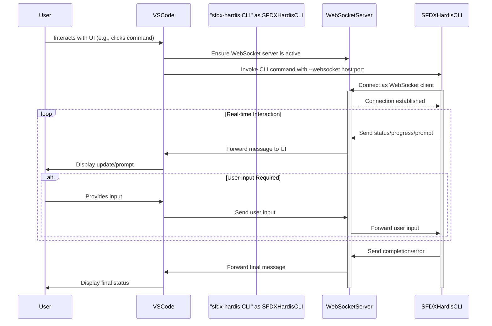
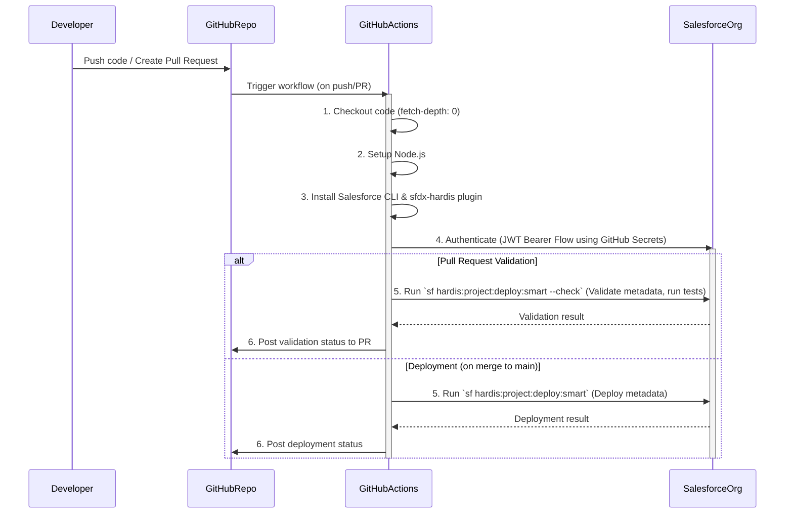
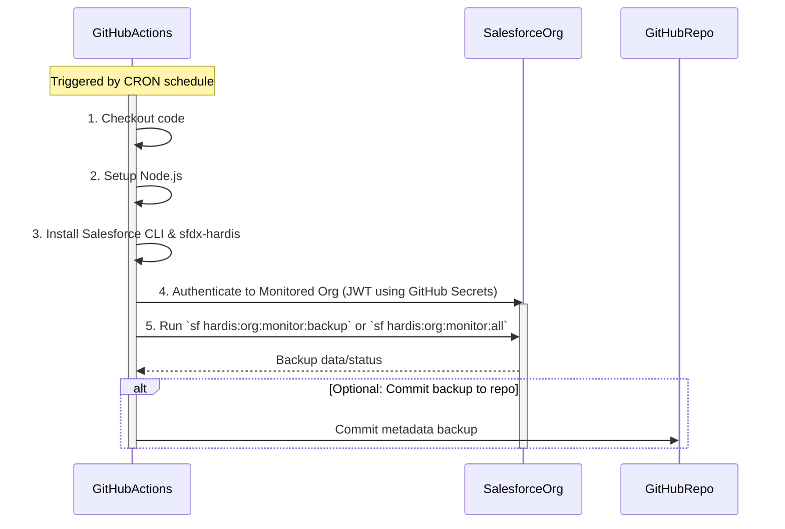

# WebSocket Flow - Shows the interactive communication between User, VSCode, CLI, and WebSocket Server

# CI/CD Flow - Shows the GitHub Actions deployment and validation process

# Monitoring Flow - Shows the scheduled org monitoring via GitHub Actions

