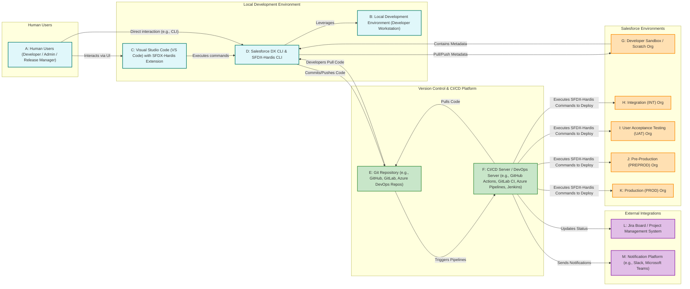

# SFDX-Hardis-demo

## Detailed Explanation of Diagram Components:

### A: Human Users (Developer / Admin / Release Manager)
*   **Kind of Participant:** Individuals involved in the Salesforce development and release process, including developers writing code, Salesforce administrators performing declarative configurations, and release managers overseeing the CI/CD pipeline.
*   **Role:** Initiate tasks, write/configure metadata, review code, approve deployments, and monitor the overall process.
*   **Location:** Operate from their local workstations.

### B: Local Development Environment (Developer Workstation)
*   **Kind of Participant:** The physical or virtual computer where a developer or administrator performs their daily work.
*   **Role:** Hosts all necessary tools for Salesforce development, including the IDE, CLIs, and a local copy of the Git repository.
*   **Location:** Local to each individual user.

### C: Visual Studio Code (VS Code) with SFDX-Hardis Extension
*   **Kind of Participant:** The Integrated Development Environment (IDE) used for writing and managing Salesforce code and metadata. The SFDX-Hardis Visual Studio Code Extension provides a graphical user interface (UI) that simplifies complex Git and Salesforce DX operations.
*   **Role:** Primary interface for developers and admins to interact with their local codebase and Salesforce orgs.
*   **Location:** Installed on the Local Development Environment (B).

### D: Salesforce DX CLI & SFDX-Hardis CLI
*   **Kind of Participant:** Command-line interface (CLI) tools. Salesforce DX CLI is Salesforce's official tool, and SFDX-Hardis is installed as a plugin, extending its capabilities with specialized commands for automating Salesforce DevOps tasks.
*   **Role:** Execute commands to pull/push metadata from/to Salesforce orgs, run tests, validate deployments, and interact with the Git repository.
*   **Location:** Installed on the Local Development Environment (B).

### E: Git Repository (e.g., GitHub, GitLab, Azure DevOps Repos)
*   **Kind of Participant:** The central version control system. It stores all Salesforce metadata and project configurations, acting as the single source of truth for the codebase.
*   **Role:** Manages version history, enables branching and merging, facilitates collaboration among developers, and serves as the source for CI/CD pipelines.
*   **Location:** A remote server (cloud-hosted service or on-premise Git server), forming a fundamental part of the "DevOps server" infrastructure.

### F: CI/CD Server / DevOps Server (e.g., GitHub Actions, GitLab CI, Azure Pipelines, Jenkins)
*   **Kind of Participant:** The automation engine that orchestrates the Continuous Integration and Continuous Deployment (CI/CD) pipeline.
*   **Role:** Monitors the Git Repository (E) for changes, automatically triggers predefined workflows (pipelines), pulls the latest code, executes SFDX-Hardis commands for validation, testing, and deployment to various Salesforce Environments (H, I, J, K). It also handles integrations with external systems (L, M).
*   **Location:** This is the "DevOps server." It can be a cloud-based service or an on-premise server.

### G: Developer Sandbox / Scratch Org
*   **Kind of Participant:** Isolated Salesforce environments provided for individual developers to build and test their features without affecting other team members.
*   **Role:** Used for initial development, unit testing, and pulling changes to the local Git repository.
*   **Location:** Salesforce cloud.

### H: Integration (INT) Org
*   **Kind of Participant:** A shared Salesforce environment where changes from multiple feature branches are integrated and tested together. It's typically the first shared environment in the release pipeline.
*   **Role:** Ensures compatibility and stability of combined features before moving to higher environments.
*   **Location:** Salesforce cloud.

### I: User Acceptance Testing (UAT) Org
*   **Kind of Participant:** A Salesforce environment dedicated to User Acceptance Testing. Business users and stakeholders validate new features against their requirements here.
*   **Role:** Critical for ensuring that the developed features meet business needs and are ready for production.
*   **Location:** Salesforce cloud.

### J: Pre-Production (PREPROD) Org
*   **Kind of Participant:** A staging Salesforce environment that closely mirrors the Production (K) environment.
*   **Role:** Used for final smoke tests, performance testing, and last-minute validations to catch any issues before the production release.
*   **Location:** Salesforce cloud.

### K: Production (PROD) Org
*   **Kind of Participant:** The live Salesforce environment that end-users interact with. This is the ultimate target for all validated and approved changes.
*   **Role:** Hosts the live business operations.
*   **Location:** Salesforce cloud.

### L: Jira Board / Project Management System
*   **Kind of Participant:** An external system (like Jira, Azure Boards) used for project management, tracking tasks, bugs, and features.
*   **Role:** SFDX-Hardis integrates with these systems to automatically update ticket statuses and add comments based on deployment events, providing end-to-end traceability.
*   **Location:** External SaaS or on-premise server.

### M: Notification Platform (e.g., Slack, Microsoft Teams)
*   **Kind of Participant:** An external communication system.
*   **Role:** SFDX-Hardis can send automated notifications about deployment statuses (successes, failures), including details from linked Jira tickets, to relevant team channels, ensuring prompt communication and awareness.
*   **Location:** External SaaS.
