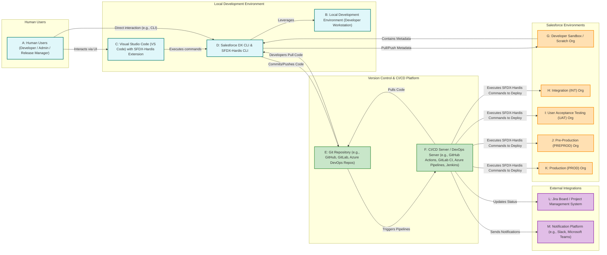

```mermaid
graph LR
    subgraph "Human Users"
        A["A: Human Users (Developer / Admin / Release Manager)"]
    end

    subgraph "Local Development Environment"
        B["B: Local Development Environment (Developer Workstation)"]
        C["C: Visual Studio Code (VS Code) with SFDX-Hardis Extension"]
        D["D: Salesforce DX CLI & SFDX-Hardis CLI"]
    end

    subgraph "Version Control & CI/CD Platform"
        E["E: Git Repository (e.g., GitHub, GitLab, Azure DevOps Repos)"]
        F["F: CI/CD Server / DevOps Server (e.g., GitHub Actions, GitLab CI, Azure Pipelines, Jenkins)"]
    end

    subgraph "Salesforce Environments"
        G["G: Developer Sandbox / Scratch Org"]
        H["H: Integration (INT) Org"]
        I["I: User Acceptance Testing (UAT) Org"]
        J["J: Pre-Production (PREPROD) Org"]
        K["K: Production (PROD) Org"]
    end

    subgraph "External Integrations"
        L["L: Jira Board / Project Management System"]
        M["M: Notification Platform (e.g., Slack, Microsoft Teams)"]
    end

    A -- Interacts via UI --> C
    C -- Executes commands --> D
    D -- Leverages --> B

    A -- Direct interaction (e.g., CLI) --> D

    D -- Pull/Push Metadata --> G
    G -- Contains Metadata --> D

    D -- Commits/Pushes Code --> E
    E -- Developers Pull Code --> D

    E -- Triggers Pipelines --> F
    F -- Pulls Code --> E
    F -- Executes SFDX-Hardis Commands to Deploy --> H
    F -- Executes SFDX-Hardis Commands to Deploy --> I
    F -- Executes SFDX-Hardis Commands to Deploy --> J
    F -- Executes SFDX-Hardis Commands to Deploy --> K

    F -- Updates Status --> L
    F -- Sends Notifications --> M

    style A fill:#e0f7fa,stroke:#00796b,stroke-width:2px
    style B fill:#e0f7fa,stroke:#00796b,stroke-width:2px
    style C fill:#e0f7fa,stroke:#00796b,stroke-width:2px
    style D fill:#e0f7fa,stroke:#00796b,stroke-width:2px

    style E fill:#c8e6c9,stroke:#388e3c,stroke-width:2px
    style F fill:#c8e6c9,stroke:#388e3c,stroke-width:2px

    style G fill:#ffe0b2,stroke:#fb8c00,stroke-width:2px
    style H fill:#ffe0b2,stroke:#fb8c00,stroke-width:2px
    style I fill:#ffe0b2,stroke:#fb8c00,stroke-width:2px
    style J fill:#ffe0b2,stroke:#fb8c00,stroke-width:2px
    style K fill:#ffe0b2,stroke:#fb8c00,stroke-width:2px

    style L fill:#e1bee7,stroke:#8e24aa,stroke-width:2px
    style M fill:#e1bee7,stroke:#8e24aa,stroke-width:2px
```
