# SFDX-Hardis Complete Demo Guide

```mermaid
graph TB
    subgraph "Project Root"
        SFDX[".sfdx-hardis.yml<br/>🎯 Master Configuration"]
        PROJ["sfdx-project.json<br/>📦 Project Definition"]
        GIT[".gitignore<br/>🚫 Git Exclusions"]
        README["README.md<br/>📖 Documentation"]
    end

    subgraph "Configuration Files"
        subgraph "config/"
            SCRATCH_DEV["project-scratch-def.json<br/>🔧 Dev Environment"]
            SCRATCH_INT["project-scratch-def-integration.json<br/>🔧 Integration Environment"]
            SCRATCH_UAT["project-scratch-def-uat.json<br/>🔧 UAT Environment"]
            PMD["pmd-ruleset.xml<br/>🔍 Code Quality Rules"]
            ESLINT[".eslintrc.json<br/>⚡ Lightning Linting"]
        end
    end

    subgraph "Source Code"
        subgraph "force-app/main/default/"
            subgraph "objects/Account/"
                FIELD["fields/Customer_Type__c.field-meta.xml<br/>📝 Custom Field"]
                VALIDATION["validationRules/Customer_Type_Required.validationRule-meta.xml<br/>✅ Validation Rule"]
            end
            
            subgraph "classes/"
                APEX_CLASS["AccountController.cls<br/>🧠 Apex Logic"]
                APEX_TEST["AccountControllerTest.cls<br/>🧪 Test Class"]
            end
            
            subgraph "lwc/"
                LWC_JS["customerTypeSelector/customerTypeSelector.js<br/>⚡ Lightning Component"]
                LWC_HTML["customerTypeSelector/customerTypeSelector.html<br/>🎨 Component Template"]
                LWC_META["customerTypeSelector/customerTypeSelector.js-meta.xml<br/>📋 Component Metadata"]
            end
        end
    end

    subgraph "Data Management"
        subgraph "data/"
            DATA_PLAN_DEV["dev-data-plan.json<br/>🗃️ Dev Data Plan"]
            DATA_PLAN_INT["integration-data-plan.json<br/>🗃️ Integration Data Plan"]
            DATA_PLAN_UAT["uat-data-plan.json<br/>🗃️ UAT Data Plan"]
            ACCOUNT_CSV["Account.csv<br/>📊 Test Accounts"]
            CONTACT_CSV["Contact.csv<br/>📊 Test Contacts"]
        end
    end

    subgraph "Scripts & Automation"
        subgraph "scripts/"
            subgraph "apex/"
                SETUP_DEV["setup-dev-data.apex<br/>🔧 Dev Data Setup"]
                SETUP_INT["setup-integration-data.apex<br/>🔧 Integration Setup"]
                SETUP_UAT["setup-uat-data.apex<br/>🔧 UAT Setup"]
                POST_DEPLOY["post-data-setup.apex<br/>📤 Post-Deploy Hook"]
            end
            
            subgraph "shell/"
                PRE_DEPLOY["pre-deploy-validation.sh<br/>✅ Pre-Deploy Checks"]
                POST_DEPLOY_SH["post-deploy-notification.sh<br/>📧 Notifications"]
            end
        end
    end

    subgraph "CI/CD Pipeline"
        subgraph ".github/workflows/"
            CICD["ci-cd.yml<br/>🔄 GitHub Actions Pipeline"]
        end
        
        subgraph "Secrets (GitHub)"
            DEVHUB_SECRET["DEVHUB_SFDX_URL<br/>🔐 Dev Hub Auth"]
            SLACK_SECRET["SLACK_WEBHOOK_URL<br/>🔐 Slack Integration"]
        end
    end

    subgraph "Generated Files"
        subgraph "Generated Documentation"
            DOC_HTML["docs/index.html<br/>📚 Auto-generated Docs"]
            APEX_DOC["docs/apex/index.html<br/>📖 Apex Documentation"]
            LWC_DOC["docs/lwc/index.html<br/>⚡ LWC Documentation"]
        end
        
        subgraph "Reports"
            COVERAGE["reports/coverage.xml<br/>📊 Test Coverage"]
            PMD_REPORT["reports/pmd-report.html<br/>🔍 Code Quality Report"]
            SECURITY["reports/security-scan.json<br/>🛡️ Security Scan"]
        end
    end

    %% Configuration Relationships
    SFDX --> SCRATCH_DEV
    SFDX --> SCRATCH_INT
    SFDX --> SCRATCH_UAT
    SFDX --> PMD
    SFDX --> DATA_PLAN_DEV
    SFDX --> DATA_PLAN_INT
    SFDX --> DATA_PLAN_UAT

    %% Data Relationships
    DATA_PLAN_INT --> ACCOUNT_CSV
    DATA_PLAN_INT --> CONTACT_CSV
    DATA_PLAN_UAT --> ACCOUNT_CSV
    DATA_PLAN_UAT --> CONTACT_CSV

    %% Script Relationships
    SFDX --> SETUP_DEV
    SFDX --> SETUP_INT
    SFDX --> SETUP_UAT
    SFDX --> PRE_DEPLOY
    SFDX --> POST_DEPLOY_SH
    DATA_PLAN_INT --> POST_DEPLOY

    %% CI/CD Relationships
    CICD --> DEVHUB_SECRET
    CICD --> SLACK_SECRET
    CICD --> SFDX
    CICD --> PMD
    CICD --> ESLINT

    %% Source Dependencies
    APEX_TEST --> APEX_CLASS
    LWC_JS --> FIELD
    VALIDATION --> FIELD

    %% Generated Content
    SFDX --> DOC_HTML
    APEX_CLASS --> APEX_DOC
    LWC_JS --> LWC_DOC
    CICD --> COVERAGE
    PMD --> PMD_REPORT
    CICD --> SECURITY

    %% Styling
    classDef configFile fill:#e1f5fe,stroke:#01579b,stroke-width:2px
    classDef sourceFile fill:#f3e5f5,stroke:#4a148c,stroke-width:2px
    classDef dataFile fill:#e8f5e8,stroke:#1b5e20,stroke-width:2px
    classDef scriptFile fill:#fff3e0,stroke:#e65100,stroke-width:2px
    classDef cicdFile fill:#fce4ec,stroke:#880e4f,stroke-width:2px
    classDef generatedFile fill:#f1f8e9,stroke:#33691e,stroke-width:2px

    class SFDX,SCRATCH_DEV,SCRATCH_INT,SCRATCH_UAT,PMD,ESLINT,PROJ configFile
    class FIELD,VALIDATION,APEX_CLASS,APEX_TEST,LWC_JS,LWC_HTML,LWC_META sourceFile
    class DATA_PLAN_DEV,DATA_PLAN_INT,DATA_PLAN_UAT,ACCOUNT_CSV,CONTACT_CSV dataFile
    class SETUP_DEV,SETUP_INT,SETUP_UAT,POST_DEPLOY,PRE_DEPLOY,POST_DEPLOY_SH scriptFile
    class CICD,DEVHUB_SECRET,SLACK_SECRET cicdFile
    class DOC_HTML,APEX_DOC,LWC_DOC,COVERAGE,PMD_REPORT,SECURITY generatedFile
```


Perfect! I've created a comprehensive Mermaid diagram that shows all the files involved in the SFDX-Hardis demo and their relationships. Here's what the diagram illustrates:

## 🎯 **Key File Categories:**

### **🔧 Configuration Files (Blue)**
- `.sfdx-hardis.yml` - Master configuration orchestrating everything
- Scratch org definitions for each environment
- Code quality rules (PMD, ESLint)

### **📝 Source Code (Purple)**
- Custom field and validation rule (our demo feature)
- Apex classes and tests
- Lightning Web Components

### **🗃️ Data Files (Green)**
- Environment-specific data plans
- CSV files with test data
- Data seeding configurations

### **🔨 Scripts (Orange)**
- Apex scripts for environment setup
- Shell scripts for automation hooks
- Pre/post deployment validations

### **🔄 CI/CD Files (Pink)**
- GitHub Actions workflow
- Secrets management
- Pipeline configuration

### **📊 Generated Files (Light Green)**
- Auto-generated documentation
- Test coverage reports
- Security scan results

## 🔗 **Key Relationships Shown:**

1. **Central Orchestration**: `.sfdx-hardis.yml` controls most other files
2. **Environment Separation**: Different configs for dev/integration/UAT
3. **Data Flow**: Data plans link to CSV files and setup scripts
4. **Automation Chain**: CI/CD triggers quality checks and generates reports
5. **Dependencies**: Tests depend on classes, components use custom fields

This diagram demonstrates how SFDX-Hardis creates a cohesive ecosystem where configuration drives behavior, and everything is interconnected through the central YAML file!

## Overview

This demo showcases how **sfdx-hardis** streamlines Salesforce DevOps by delivering a task from development through integration to UAT using scratch orgs and automated CI/CD pipelines.

### What is SFDX-Hardis?

SFDX-Hardis is a powerful DevOps toolkit that extends Salesforce CLI capabilities with:
- **Smart deployment strategies** with automatic dependency resolution
- **Advanced scratch org management** with data seeding and configuration
- **Integrated CI/CD pipelines** with comprehensive testing
- **Automated quality checks** and security scans
- **Simplified team collaboration** with branch-based development

---

## Prerequisites

### System Requirements
- Node.js 18+ installed
- Git configured
- Salesforce CLI (sf) installed
- VS Code with Salesforce extensions (recommended)

### Accounts Needed
- Salesforce Developer Hub org (free)
- GitHub account (free)
- GitHub Actions enabled

---

## Part 1: Installation & Setup

### 1.1 Install SFDX-Hardis

```bash
# Install globally
npm install -g sfdx-hardis

# Verify installation
sfdx hardis:version
```

### 1.2 Set Up Development Hub

```bash
# Authenticate to your Dev Hub
sf org login web --set-default-dev-hub --alias DevHub

# Enable Dev Hub features if not already done
# (This is done in Setup > Dev Hub in your org)
```

### 1.3 Initialize Project

```bash
# Create project directory
mkdir salesforce-demo-project
cd salesforce-demo-project

# Initialize SFDX project with hardis enhancements
sfdx hardis:project:create --projectname "Demo Project" --packagename "demo"

# Initialize git repository
git init
git add .
git commit -m "Initial project setup"
```

### 1.4 SFDX-Hardis Configuration File

SFDX-Hardis uses a central `.sfdx-hardis.yml` configuration file that controls all DevOps behaviors:

**`.sfdx-hardis.yml`:**
```yaml
# SFDX-Hardis Configuration File
# This file controls all DevOps automation behaviors

# Project identification
projectName: "Demo Project"
packageName: "demo"
targetDevHubAlias: "DevHub"

# Branch management strategy
branchStrategy:
  developmentBranch: "main"
  integrationBranches: ["integration", "preprod"]
  productionBranches: ["uat", "master"]

# Scratch org configurations
scratchOrgs:
  # Development scratch orgs (for developers)
  dev:
    definitionFile: "config/project-scratch-def.json" 
    duration: 30
    features: ["MultiCurrency", "EnableSetPasswordInApi"]
    installPackages: []
    dataSeeding: true
    postDeployScripts: ["scripts/apex/setup-dev-data.apex"]
    
  # Integration environment
  integration:
    definitionFile: "config/project-scratch-def-integration.json"
    duration: 7
    features: ["MultiCurrency", "EnableSetPasswordInApi"] 
    installPackages: []
    dataSeeding: true
    postDeployScripts: 
      - "scripts/apex/setup-integration-data.apex"
      - "scripts/apex/configure-integration-settings.apex"
    
  # UAT environment  
  uat:
    definitionFile: "config/project-scratch-def-uat.json"
    duration: 30
    features: ["MultiCurrency", "EnableSetPasswordInApi"]
    installPackages: []
    dataSeeding: true
    postDeployScripts: 
      - "scripts/apex/setup-uat-data.apex"
      - "scripts/apex/configure-uat-settings.apex"

# Deployment strategies
deployment:
  # Smart deployment options
  smartDeployment: true
  checkOnly: false
  testLevel: "RunLocalTests"
  
  # Deployment validation rules
  validationRules:
    enforceCodeCoverage: true
    minimumCoverage: 75
    enforceApexDoc: true
    runStaticAnalysis: true
    
  # Pre/Post deployment hooks
  preDeployHooks:
    - "scripts/shell/pre-deploy-validation.sh"
    - "sfdx hardis:lint:access"
    
  postDeployHooks:
    - "scripts/shell/post-deploy-notification.sh"
    - "sfdx hardis:doc:generate"

# Testing configuration
testing:
  # Apex testing
  apex:
    runAllTests: false
    runLocalTests: true
    codeCoverageWarning: 75
    codeCoverageError: 60
    
  # UI testing (optional)
  ui:
    enabled: false
    framework: "selenium"
    
  # Load testing (optional)  
  load:
    enabled: false

# Quality gates and code analysis
quality:
  # ESLint for Lightning components
  eslint:
    enabled: true
    configFile: ".eslintrc.json"
    
  # PMD for Apex
  pmd:
    enabled: true
    ruleSet: "config/pmd-ruleset.xml"
    
  # Security scanning
  security:
    enabled: true
    skipSecurityScan: false
    
  # Access rights analysis
  accessRights:
    enabled: true
    generateReports: true

# Data management
data:
  # Data seeding configuration
  seeding:
    enabled: true
    dataPlans:
      dev: "data/dev-data-plan.json"
      integration: "data/integration-data-plan.json" 
      uat: "data/uat-data-plan.json"
      
  # Data export/import settings
  export:
    enabled: true
    objects: ["Account", "Contact", "Opportunity", "Case"]
    
# CI/CD Pipeline configuration
cicd:
  # Pipeline behaviors
  autoCreateIntegrationOrg: true
  autoRunTests: true
  autoGenerateDoc: true
  
  # Notification settings
  notifications:
    slack:
      enabled: false
      webhook: "${SLACK_WEBHOOK_URL}"
      
    email:
      enabled: true
      recipients: ["admin@demo.com"]
      
    teams:
      enabled: false
      webhook: "${TEAMS_WEBHOOK_URL}"

# Environment-specific overrides
environments:
  integration:
    deployment:
      testLevel: "RunLocalTests"
      checkOnly: false
    notifications:
      enabled: true
      
  uat:
    deployment:
      testLevel: "RunAllTestsInOrg"
      checkOnly: false
    data:
      seeding:
        enabled: true
        plan: "uat"
        
  production:
    deployment:
      testLevel: "RunAllTestsInOrg" 
      checkOnly: true
      requireManualApproval: true
    quality:
      enforceCodeCoverage: true
      minimumCoverage: 85

# Monitoring and reporting
monitoring:
  enabled: true
  generateReports: true
  reportFormats: ["html", "json"]
  
# Advanced features
advanced:
  # Automatic documentation generation
  documentation:
    enabled: true
    formats: ["html", "markdown"]
    includeApexDoc: true
    includeLWCDoc: true
    
  # Package management
  packages:
    autoInstall: true
    dependencies: []
    
  # Multi-org management
  multiOrg:
    enabled: false
    
# Plugin configurations
plugins:
  # Scanner plugins
  scanner:
    enabled: true
    
  # Custom plugins
  custom: []
```

### How the Configuration File Works

**🔧 Hierarchical Configuration:**
- Global settings apply to all environments
- Environment-specific settings override globals
- Command-line parameters override file settings

**🎯 Key Behaviors Controlled:**

1. **Scratch Org Management:**
   ```bash
   # Uses .sfdx-hardis.yml scratchOrgs.integration config
   sfdx hardis:org:create --config integration
   ```

2. **Smart Deployment:**
   ```bash
   # Applies deployment.smartDeployment and quality rules
   sfdx hardis:source:deploy --smart
   ```

3. **Automated Testing:**
   ```bash
   # Uses testing.apex configuration
   sfdx hardis:apex:test:run --coverage
   ```

4. **Data Seeding:**
   ```bash
   # Uses data.seeding configuration and plans
   sfdx hardis:data:seed --plan integration
   ```

### 1.5 Additional Configuration Files

SFDX-Hardis also uses several complementary configuration files:

**Data Plans (`data/integration-data-plan.json`):**
```json
{
  "name": "Integration Data Plan",
  "description": "Test data for integration environment",
  "objects": [
    {
      "sobject": "Account",
      "file": "data/Account.csv",
      "externalId": "Name"
    },
    {
      "sobject": "Contact", 
      "file": "data/Contact.csv",
      "externalId": "Email"
    }
  ],
  "postProcessing": [
    "scripts/apex/post-data-setup.apex"
  ]
}
```

**PMD Ruleset (`config/pmd-ruleset.xml`):**
```xml
<?xml version="1.0" encoding="UTF-8"?>
<ruleset name="SFDX-Hardis Apex Rules">
    <rule ref="category/apex/design.xml/CyclomaticComplexity">
        <properties>
            <property name="reportLevel" value="10"/>
        </properties>
    </rule>
    <rule ref="category/apex/bestpractices.xml/ApexUnitTestClassShouldHaveAsserts"/>
    <rule ref="category/apex/security.xml/ApexSharingViolations"/>
</ruleset>
```

Create enhanced scratch org definitions:

**config/project-scratch-def-integration.json:**
```json
{
  "orgName": "Integration Environment",
  "description": "Integration scratch org for continuous testing",
  "edition": "Developer",
  "features": ["EnableSetPasswordInApi", "MultiCurrency"],
  "settings": {
    "lightningExperienceSettings": {
      "enableS1DesktopEnabled": true
    },
    "securitySettings": {
      "sessionSettings": {
        "sessionTimeout": "TwentyFourHours"
      }
    }
  },
  "adminEmail": "admin@demo-integration.com"
}
```

**config/project-scratch-def-uat.json:**
```json
{
  "orgName": "UAT Environment", 
  "description": "UAT scratch org for user acceptance testing",
  "edition": "Developer",
  "features": ["EnableSetPasswordInApi", "MultiCurrency"],
  "settings": {
    "lightningExperienceSettings": {
      "enableS1DesktopEnabled": true
    }
  },
  "adminEmail": "admin@demo-uat.com"
}
```

---

## Part 2: GitHub Repository Setup

### 2.1 Create GitHub Repository

1. Go to GitHub and create a new public repository: `salesforce-sfdx-hardis-demo`
2. Don't initialize with README (we already have files)

### 2.2 Connect Local Repository

```bash
# Add GitHub remote
git remote add origin https://github.com/YOUR_USERNAME/salesforce-sfdx-hardis-demo.git

# Push initial code
git branch -M main
git push -u origin main
```

### 2.3 Configure GitHub Actions

Create `.github/workflows/ci-cd.yml`:

```yaml
name: SFDX-Hardis CI/CD Pipeline

on:
  push:
    branches: [ main, integration, uat ]
  pull_request:
    branches: [ main, integration, uat ]

jobs:
  build-and-test:
    runs-on: ubuntu-latest
    
    steps:
    - uses: actions/checkout@v3
    
    - name: Setup Node.js
      uses: actions/setup-node@v3
      with:
        node-version: '18'
        
    - name: Install Salesforce CLI
      run: npm install -g @salesforce/cli
      
    - name: Install SFDX-Hardis
      run: npm install -g sfdx-hardis
      
    - name: Authenticate Dev Hub
      run: |
        echo "${{ secrets.DEVHUB_SFDX_URL }}" > ./DEVHUB_SFDX_URL.txt
        sf org login sfdx-url --sfdx-url-file ./DEVHUB_SFDX_URL.txt --alias DevHub --set-default-dev-hub
        
    - name: Run SFDX-Hardis Quality Checks
      run: sfdx hardis:lint:access
      
    - name: Create Scratch Org and Deploy
      if: github.ref == 'refs/heads/integration'
      run: |
        sfdx hardis:org:create --scratch --config integration
        sfdx hardis:source:deploy --check-only
        
    - name: Run Tests
      if: github.ref == 'refs/heads/integration'
      run: sfdx hardis:apex:test:run --coverage
      
    - name: Deploy to UAT
      if: github.ref == 'refs/heads/uat' 
      run: |
        sfdx hardis:org:create --scratch --config uat
        sfdx hardis:source:deploy
        sfdx hardis:data:seed
```

---

## Part 3: Development Workflow Demo

### 3.1 Create Feature Branch

```bash
# Create feature branch for our demo task
git checkout -b feature/customer-validation

# Create local development scratch org
sfdx hardis:org:create --scratch --config dev --alias DevOrg
```

### 3.2 Develop the Feature

**Demo Task:** Create a custom field with validation on Account object

```bash
# Generate custom field metadata
sf sobject field create --label "Customer Type" --name Customer_Type__c --type Picklist --required --target-org DevOrg

# Add picklist values via VS Code or manually create the field
```

Create **force-app/main/default/objects/Account/fields/Customer_Type__c.field-meta.xml:**

```xml
<?xml version="1.0" encoding="UTF-8"?>
<CustomField xmlns="http://soap.sforce.com/2006/04/metadata">
    <fullName>Customer_Type__c</fullName>
    <label>Customer Type</label>
    <required>true</required>
    <trackFeedHistory>false</trackFeedHistory>
    <type>Picklist</type>
    <valueSet>
        <restricted>true</restricted>
        <valueSetDefinition>
            <sorted>false</sorted>
            <value>
                <fullName>Enterprise</fullName>
                <default>false</default>
                <label>Enterprise</label>
            </value>
            <value>
                <fullName>SMB</fullName>
                <default>false</default>
                <label>Small/Medium Business</label>
            </value>
            <value>
                <fullName>Startup</fullName>
                <default>false</default>
                <label>Startup</label>
            </value>
        </valueSetDefinition>
    </valueSet>
</CustomField>
```

Create validation rule **force-app/main/default/objects/Account/validationRules/Customer_Type_Required.validationRule-meta.xml:**

```xml
<?xml version="1.0" encoding="UTF-8"?>
<ValidationRule xmlns="http://soap.sforce.com/2006/04/metadata">
    <fullName>Customer_Type_Required</fullName>
    <active>true</active>
    <description>Customer Type is required for all accounts</description>
    <errorConditionFormula>ISBLANK(TEXT(Customer_Type__c))</errorConditionFormula>
    <errorMessage>Please select a Customer Type</errorMessage>
</ValidationRule>
```

### 3.3 Deploy and Test Locally

```bash
# Deploy to development scratch org
sfdx hardis:source:deploy --target-org DevOrg

# Run quality checks
sfdx hardis:lint:access

# Create test data
sfdx hardis:data:seed --target-org DevOrg
```

### 3.4 Commit Changes

```bash
git add .
git commit -m "feat: Add Customer Type field with validation

- Added required Customer Type picklist field to Account
- Implemented validation rule to ensure field is populated
- Added test data for validation scenarios"
```

---

## Part 4: Integration Deployment

### 4.1 Create Integration Branch

```bash
# Push feature branch
git push origin feature/customer-validation

# Create integration branch
git checkout -b integration
git merge feature/customer-validation
git push origin integration
```

### 4.2 SFDX-Hardis Advantages in Integration

**Automated Integration Scratch Org Creation:**

```bash
# SFDX-Hardis automatically creates fresh integration environment
sfdx hardis:org:create --scratch --config integration --alias IntegrationOrg

# Smart deployment with dependency checking
sfdx hardis:source:deploy --target-org IntegrationOrg --smart
```

**Key Advantages Demonstrated:**

1. **Dependency Resolution:** SFDX-Hardis automatically resolves metadata dependencies
2. **Smart Deployment:** Only deploys changed components
3. **Automatic Testing:** Runs all relevant tests automatically
4. **Quality Gates:** Enforces code coverage and quality standards
5. **Environment Consistency:** Ensures integration environment matches production

### 4.3 Integration Testing

```bash
# Run comprehensive test suite
sfdx hardis:apex:test:run --target-org IntegrationOrg --coverage --wait 10

# Check deployment status
sfdx hardis:source:deploy:report --target-org IntegrationOrg

# Validate with test data
sfdx hardis:data:seed --target-org IntegrationOrg --plan integration
```

---

## Part 5: UAT Deployment

### 5.1 Promote to UAT

```bash
# Create UAT branch from integration
git checkout -b uat
git merge integration
git push origin uat
```

### 5.2 UAT Environment Setup

```bash
# Create UAT scratch org with specific configuration
sfdx hardis:org:create --scratch --config uat --alias UATOrg --duration 30

# Deploy with UAT-specific settings
sfdx hardis:source:deploy --target-org UATOrg --environment uat

# Seed with UAT test data
sfdx hardis:data:seed --target-org UATOrg --plan uat
```

### 5.3 User Acceptance Testing

**SFDX-Hardis UAT Advantages:**

1. **Fresh Environment:** Each UAT cycle gets a clean, consistent environment
2. **Production-like Data:** Configurable test data that mirrors production scenarios
3. **Easy Reset:** Can quickly recreate UAT environment if needed
4. **User Training:** Perfect environment for user training and documentation

```bash
# Generate UAT test credentials
sfdx hardis:org:user:create --target-org UATOrg --alias "uat-user@demo.com"

# Create demo data for UAT testing
sfdx hardis:data:create --plan uat-demo --target-org UATOrg
```

---

## Part 6: SFDX-Hardis Key Advantages Summary

### 6.1 Development Experience
- **Faster Setup:** Automated scratch org creation with pre-configured settings
- **Smart Deployments:** Only deploy what changed, with automatic dependency resolution
- **Quality Assurance:** Built-in code analysis and security scanning

### 6.2 Team Collaboration
- **Branch-based Development:** Clean separation of features and environments
- **Consistent Environments:** Reproducible scratch orgs across team members
- **Automated Testing:** Comprehensive test execution with coverage reporting

### 6.3 CI/CD Pipeline Benefits
- **Automated Workflows:** GitHub Actions integration with minimal configuration
- **Environment Promotion:** Streamlined promotion from dev → integration → UAT → production
- **Quality Gates:** Automatic enforcement of coding standards and test coverage

### 6.4 Operational Efficiency
- **Cost Effective:** Uses free scratch orgs instead of paid sandboxes
- **Rapid Provisioning:** Create/destroy environments in minutes
- **Scalable:** Handle multiple feature branches and parallel development

---

## Part 7: Demo Script

### Demo Flow (15-20 minutes)

1. **Introduction (2 min)**
   - Show GitHub repository structure
   - Explain the customer validation feature requirement

2. **Development Phase (5 min)**
   - Create feature branch
   - Show automated scratch org creation
   - Deploy custom field and validation rule
   - Demonstrate local testing

3. **Integration Phase (5 min)**
   - Merge to integration branch
   - Show GitHub Actions pipeline execution
   - Demonstrate smart deployment features
   - Review automated test results

4. **UAT Phase (5 min)**
   - Promote to UAT branch
   - Show UAT scratch org creation
   - Demonstrate user acceptance testing environment
   - Show test data seeding

5. **Wrap-up (3 min)**
   - Highlight key SFDX-Hardis advantages
   - Show cost savings vs traditional sandboxes
   - Demonstrate environment cleanup

### Key Talking Points

- **"No more waiting for sandboxes"** - Scratch orgs ready in 2 minutes
- **"Smart deployments"** - Only deploy what changed, resolve dependencies automatically  
- **"True CI/CD"** - Automated testing and quality gates
- **"Cost-effective DevOps"** - Free scratch orgs vs expensive sandboxes
- **"Team scalability"** - Each developer gets their own environment

---

## Part 8: Cleanup

```bash
# Delete scratch orgs
sfdx hardis:org:delete --target-org DevOrg
sfdx hardis:org:delete --target-org IntegrationOrg  
sfdx hardis:org:delete --target-org UATOrg

# Clean up local branches
git checkout main
git branch -D feature/customer-validation integration uat
```

---

## Conclusion

This demo showcases how SFDX-Hardis transforms Salesforce development from a manual, error-prone process into a streamlined, automated DevOps pipeline. The combination of scratch orgs, smart deployments, and automated testing creates a professional development experience that scales with your team.

**Next Steps:**
- Explore advanced SFDX-Hardis features like automated documentation
- Set up monitoring and alerts for production deployments
- Implement advanced testing strategies with data factories
- Configure advanced security scanning and compliance checks
