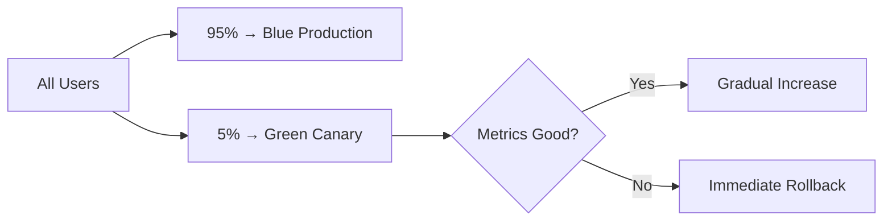

# Blue-Green Deployment Strategy for Salesforce: Complete Implementation Guide (Claude 4)

## What is Blue-Green Deployment?

Blue-Green deployment is a technique that reduces downtime and risk by running two identical production environments called Blue and Green. At any given time, only one environment is live, serving all production traffic, while the other remains idle or serves as staging.

## Why Blue-Green for Salesforce?

### Traditional Salesforce Deployment Challenges
- **Downtime during deployments**: Users can't access the system during metadata deployments
- **Rollback complexity**: Reverting failed deployments is time-consuming and risky
- **Limited testing with production data**: Hard to validate changes with real data volumes
- **Integration disruptions**: External systems affected during maintenance windows

### Blue-Green Solutions
- **Zero-downtime deployments**: Users never experience service interruption
- **Instant rollbacks**: Switch back to previous version in seconds
- **Production-like testing**: Validate on identical environment with real data
- **Risk mitigation**: Isolate new releases before full exposure

---

## Salesforce Blue-Green Architecture Components

### 1. Environment Setup
- **Blue Environment**: Current production Salesforce org
- **Green Environment**: Full Copy Sandbox (identical to production)
- **Traffic Router**: DNS/CDN layer to control user routing
- **Monitoring**: Health checks and performance metrics

### 2. Key Salesforce Considerations
- **Data Synchronization**: Full Copy Sandbox refreshed regularly
- **Custom Domains**: Enable seamless traffic switching
- **API Integration**: External systems adapt to environment changes
- **User Sessions**: Handle active user sessions during switches

---

## Implementation with SFDX-Hardis

### Configuration Example
```yaml
# .sfdx-hardis.yml
blueGreenConfig:
  productionOrg: "blue-production"
  stagingOrg: "green-fullcopy"
  trafficSwitchStrategy: "gradual"
  rollbackThreshold:
    errorRate: 5
    responseTime: 2000
  healthChecks:
    - apex-tests
    - integration-tests
    - performance-benchmarks
```

### GitHub Actions Workflow
```yaml
name: Blue-Green Production Deployment

on:
  push:
    branches: [main]

jobs:
  blue-green-deploy:
    runs-on: ubuntu-latest
    steps:
      - name: Deploy to Green Environment
        run: |
          sf hardis:project:deploy:smart \
            --target-org green-fullcopy \
            --check-only false
      
      - name: Validate Green Environment
        run: |
          sf hardis:org:monitor:all \
            --target-org green-fullcopy \
            --wait-for-results
      
      - name: Promote to Production
        run: |
          sf hardis:project:deploy:bluegreen \
            --source-org green-fullcopy \
            --target-org blue-production \
            --strategy gradual
```

---

## Deployment Process Deep Dive

### Phase 1: Green Environment Preparation
1. **Fresh Data Refresh**: Sync Full Copy Sandbox with production data
2. **Metadata Deployment**: Deploy new version to Green environment
3. **Automated Testing**: Run comprehensive test suites
4. **Performance Validation**: Benchmark response times and resource usage
5. **Integration Testing**: Verify external system connectivity

### Phase 2: Traffic Migration Strategy

#### Gradual Rollout (Recommended)
```
10% traffic → Green (Monitor for 10 minutes)
↓
25% traffic → Green (Monitor for 15 minutes)  
↓
50% traffic → Green (Monitor for 20 minutes)
↓
100% traffic → Green (Full cutover)
```

#### Immediate Cutover (High Confidence)
```
0% traffic → Green
↓
100% traffic → Green (Instant switch)
```

### Phase 3: Monitoring and Validation
- **Real-time Metrics**: Error rates, response times, throughput
- **User Experience**: Page load times, transaction success rates
- **System Health**: CPU usage, memory consumption, API limits
- **Business KPIs**: Conversion rates, user engagement metrics

---

## Rollback Scenarios and Strategies

### Automatic Rollback Triggers
- **Error Rate**: >5% increase in application errors
- **Response Time**: >50% degradation in page load times
- **Integration Failures**: External API connectivity issues
- **User Reports**: Significant increase in support tickets

### Rollback Process
1. **Detection**: Monitoring systems identify issue (30 seconds)
2. **Decision**: Automated or manual rollback trigger (30 seconds)
3. **Execution**: DNS switch back to Blue environment (30 seconds)
4. **Validation**: Confirm rollback success (60 seconds)
5. **Communication**: Notify stakeholders and log incident

**Total Rollback Time: ~2.5 minutes**

---

## Advanced Blue-Green Patterns

### 1. Canary Releases within Blue-Green


### 2. A/B Testing Integration
- **Feature Flags**: Control feature visibility per environment
- **User Segmentation**: Route specific user groups to different versions
- **Performance Comparison**: Compare metrics between Blue and Green

### 3. Database Considerations
- **Shared Database**: Both environments access same data (simpler)
- **Database per Environment**: Complete isolation (more complex)
- **Data Migration**: Handle schema changes during deployments

---

## Salesforce-Specific Challenges and Solutions

### Challenge 1: Org Limits and API Usage
**Problem**: Both environments consume org limits
**Solution**: 
- Use separate Production and Full Copy Sandbox limits
- Monitor API usage across both environments
- Implement API request routing logic

### Challenge 2: Custom Domain Management
**Problem**: Salesforce custom domains can't switch instantly
**Solution**:
- Use external load balancer/CDN for traffic routing
- Implement DNS-based switching at higher level
- Consider Salesforce Site.com for customer-facing portals

### Challenge 3: User Session Management
**Problem**: Active user sessions during environment switch
**Solution**:
- Graceful session handling with sticky sessions initially
- Implement session replication if needed
- Plan switches during low-usage periods

### Challenge 4: Integration Endpoints
**Problem**: External systems need to adapt to environment changes
**Solution**:
- Use API gateway with environment abstraction
- Implement health checks in integrations
- Configure automatic failover in external systems

---

## Monitoring and Observability

### Key Metrics to Track
```yaml
healthChecks:
  - name: "Apex Performance"
    threshold: "response_time < 2000ms"
  - name: "API Limits"
    threshold: "usage < 80%"
  - name: "Error Rates"
    threshold: "errors < 1%"
  - name: "User Experience"
    threshold: "page_load < 3000ms"
```

### Dashboards and Alerts
- **Real-time Environment Status**: Live view of Blue vs Green health
- **Deployment Progress**: Visual deployment pipeline status
- **Performance Comparison**: Side-by-side metrics analysis
- **Rollback History**: Track rollback frequency and reasons

---

## Cost Considerations

### Infrastructure Costs
- **Additional Sandbox**: Full Copy Sandbox license costs
- **Monitoring Tools**: APM and logging solutions
- **Load Balancing**: DNS/CDN services for traffic routing

### Operational Savings
- **Reduced Downtime**: Eliminate planned maintenance windows
- **Faster Recovery**: Quick rollbacks reduce incident impact
- **Improved Quality**: Better testing reduces production issues

### ROI Calculation
```
Annual Downtime Cost Savings: $500K
- Reduced incident response time: $200K  
- Eliminated planned downtime: $300K

Additional Infrastructure Cost: $100K
- Full Copy Sandbox: $60K
- Monitoring/Tools: $40K

Net Annual Savings: $400K
ROI: 400%
```

---

## Implementation Checklist

### Prerequisites ✓
- [ ] Full Copy Sandbox provisioned and configured
- [ ] Custom domains set up for both environments
- [ ] DNS/CDN routing infrastructure ready
- [ ] Monitoring and alerting systems configured
- [ ] SFDX-Hardis installed and configured
- [ ] GitHub Actions workflows created

### Testing ✓
- [ ] Blue-Green deployment tested in lower environments
- [ ] Rollback procedures validated
- [ ] Performance benchmarks established  
- [ ] Integration endpoints configured for both environments
- [ ] User acceptance testing completed

### Go-Live ✓
- [ ] Stakeholder communication plan executed
- [ ] Support team trained on new procedures
- [ ] Monitoring dashboards accessible
- [ ] Rollback decision tree documented
- [ ] Post-deployment validation checklist ready

---

## Conclusion

Blue-Green deployment transforms Salesforce releases from high-risk, disruptive events into seamless, zero-downtime operations. While it requires initial investment in infrastructure and tooling, the benefits of reduced risk, faster recovery, and improved user experience make it essential for enterprise Salesforce deployments.

SFDX-Hardis provides the intelligent automation needed to make Blue-Green deployments practical and reliable, handling the complex orchestration required for Salesforce's unique architecture and constraints.
