# Detailed Mermaid Diagrams:

 - Blue-Green Overview - High-level architecture and concept

```mermaid
graph TD
    A[GitHub Repository<br/>main branch] --> B{Blue-Green<br/>Deployment Controller}
    
    B --> C[🔵 Blue Environment<br/>Current Production<br/>Serving Live Traffic]
    B --> D[🟢 Green Environment<br/>Staging/Validation<br/>New Version]
    
    E[Load Balancer<br/>Traffic Router] --> C
    E -.-> D
    
    F[Users/API Calls] --> E
    
    G[Database<br/>Shared State] --> C
    G --> D
    
    H[External Integrations] --> E
    
    subgraph "Deployment Process"
        I[1-Deploy to Green] --> J[2-Validate Green]
        J --> K[3-Switch Traffic]
        K --> L[4-Green becomes Blue]
        L --> M[5-Old Blue becomes Green]
    end
    
    style C fill:#4A90E2,color:#fff
    style D fill:#7ED321,color:#fff
    style E fill:#F5A623,color:#fff
```


 - Salesforce Architecture - Specific implementation with Salesforce orgs and domains

```mermaid
graph TB
    subgraph "GitHub Repository"
        A[main branch<br/>New Release v2.0]
        B[GitHub Actions<br/>CI/CD Pipeline]
    end
    
    subgraph "Blue Environment (Current Production)"
        C[🔵 Production Org<br/>my-company.lightning.force.com<br/>Version 1.9 - LIVE]
        D[Custom Domain<br/>app.mycompany.com<br/>→ Blue Org]
        E[Production Data<br/>Live Customer Records]
    end
    
    subgraph "Green Environment (Staging)"
        F[🟢 Full Copy Sandbox<br/>my-company--fullcopy.sandbox.force.com<br/>Version 2.0 - STAGING]
        G[Staging Domain<br/>staging.mycompany.com<br/>→ Green Org]
        H[Refreshed Data<br/>Production Copy]
    end
    
    subgraph "Traffic Management"
        I[DNS/CDN Layer<br/>Route 53 / CloudFlare]
        J[API Gateway<br/>Load Balancer]
        K[Health Checks<br/>Monitoring]
    end
    
    subgraph "External Systems"
        L[Mobile Apps<br/>API Calls]
        M[Third-party<br/>Integrations]
        N[Customer Portal<br/>Web Traffic]
    end
    
    A --> B
    B --> F
    
    I --> D
    I -.-> G
    D --> C
    G --> F
    
    J --> I
    K --> J
    
    L --> J
    M --> J
    N --> J
    
    C --> E
    F --> H
    
    style C fill:#4A90E2,color:#fff
    style F fill:#7ED321,color:#fff
    style I fill:#F5A623,color:#fff
    style J fill:#F5A623,color:#fff
  ```
  
 - Deployment Sequence - Step-by-step deployment process with traffic migration

```mermaid
sequenceDiagram
    participant Dev as Developer
    participant GH as GitHub Actions
    participant Blue as Blue Env (Production)
    participant Green as Green Env (Staging)
    participant DNS as DNS/Load Balancer  
    participant Users as End Users
    participant Monitor as Monitoring
    
    Note over Blue: Currently serving 100% traffic
    Note over Green: Idle environment
    
    activate Blue 
    %%% Blue is active as current production
    
    Dev->>GH: Push to main branch (v2.0)
    activate GH 
    %%% GH Actions becomes active
    GH->>Green: 1. Deploy new version to Green
    activate Green 
    %%% Green becomes active for deployment
    Green-->>GH: Deployment successful
    
    GH->>Green: 2. Run automated tests
    Green-->>GH: All tests pass (checkmark)
    
    GH->>Green: 3. Run smoke tests
    Green-->>GH: Smoke tests pass (checkmark)
    
    GH->>Monitor: 4. Health check Green environment
    Monitor-->>GH: Green environment healthy (checkmark)
    
    Note over GH: Pre-switch validation complete
    
    GH->>DNS: 5. Switch 10% traffic to Green
    activate DNS 
    %%% DNS/Load Balancer becomes active
    DNS->>Users: Route 10% requests to Green
    Users->>Green: Limited production traffic
    
    GH->>Monitor: 6. Monitor Green with real traffic
    Monitor-->>GH: Metrics normal (checkmark)
    
    GH->>DNS: 7. Gradually increase to 50%
    DNS->>Users: Route 50% requests to Green
    
    GH->>Monitor: 8. Continue monitoring
    Monitor-->>GH: Performance stable (checkmark)
    
    GH->>DNS: 9. Switch 100% traffic to Green
    deactivate Blue 
    %%% Blue is now inactive for traffic
    activate Green 
    %%% Green becomes fully active for all production traffic
    deactivate DNS 
    %%% DNS/Load Balancer's main routing task is done
    
    Note over Green: Green is now Production
    Note over Blue: Blue becomes new Staging
    
    GH->>Blue: 10. Update Blue for next deployment
    deactivate GH 
    %%% GH Actions completes its main task

    Users->>Green: All production traffic
    Green-->>Users: v2.0 responses
```
 - 
 - Rollback Sequence - Emergency rollback procedures and timing

```mermaid
sequenceDiagram
    participant Monitor as Monitoring System
    participant Alert as Alert Manager
    participant GH as GitHub Actions
    participant DNS as DNS/Load Balancer
    participant Green as 🟢 Green Env (Current)
    participant Blue as 🔵 Blue Env (Previous)
    participant Users as End Users
    
    Note over Green: Serving 100% production traffic
    Note over Blue: Previous version (standby)
    
    Green->>Monitor: High error rate detected
    Monitor->>Alert: Threshold exceeded (>5% errors)
    Alert->>GH: Trigger emergency rollback
    
    activate GH
    Note over GH: Automated rollback initiated
    
    GH->>Blue: 1. Health check previous version
    Blue-->>GH: Blue environment healthy ✅
    
    GH->>DNS: 2. Emergency traffic switch
    Note over DNS: Immediate 100% switch (no gradual)
    
    DNS->>Users: Route all traffic to Blue
    Users->>Blue: All requests to previous version
    
    Note over Green: Green isolated for debugging
    Note over Blue: Blue serving production again
    
    GH->>Monitor: 3. Verify rollback success
    Monitor-->>GH: Error rate normalized ✅
    
    GH->>Alert: 4. Send rollback confirmation
    Alert->>GH: Incident logged and notifications sent
    
    deactivate GH
    
    Note over Monitor: Total rollback time: ~30 seconds
    
    rect rgb(255, 240, 240)
        Note over Green: Green environment available for<br/>debugging and hotfix development
    end
```


 - SFDX-Hardis Implementation - How your tool orchestrates the entire proces

```mermaid
sequenceDiagram
    participant Dev as Developer
    participant VS as VS Code + SFDX-Hardis
    participant GH as GitHub Actions
    participant SFDX as SFDX-Hardis CLI
    participant Blue as 🔵 Production Org
    participant Green as 🟢 Full Copy Sandbox
    participant Monitor as Org Monitor
    
    Dev->>VS: Develop new features
    VS->>Dev: Real-time validation via WebSocket
    Dev->>GH: Push to main branch
    
    activate GH
    GH->>SFDX: sf hardis:project:deploy:smart --target-org green --check
    activate SFDX
    
    SFDX->>Green: 1. Smart deployment analysis
    Green-->>SFDX: Dependency tree built
    
    SFDX->>Green: 2. Deploy delta changes only
    Green-->>SFDX: Metadata deployed successfully
    
    SFDX->>Green: 3. Execute test classes
    Green-->>SFDX: 95% code coverage ✅
    
    SFDX->>Green: 4. Data validation scripts
    Green-->>SFDX: Data integrity confirmed ✅
    
    deactivate SFDX
    SFDX-->>GH: Green environment ready
    
    GH->>Monitor: sf hardis:org:monitor:all --target-org green
    activate Monitor
    Monitor->>Green: Comprehensive health check
    Green-->>Monitor: All systems operational
    Monitor-->>GH: Health report generated ✅
    deactivate Monitor
    
    Note over GH: Interactive deployment decision
    GH->>SFDX: sf hardis:project:deploy:smart --target-org blue --promote-from green
    activate SFDX
    
    SFDX->>GH: 🤔 Promotion strategy options:<br/>1. Immediate switch<br/>2. Gradual rollout<br/>3. A/B testing mode
    GH->>SFDX: Selected: Gradual rollout
    
    SFDX->>Blue: Begin traffic migration (10%)
    SFDX->>Monitor: Monitor both environments
    activate Monitor
    
    loop Gradual Traffic Increase
        Monitor->>Blue: Check production metrics
        Monitor->>Green: Check new version metrics
        Monitor-->>SFDX: Both environments stable
        SFDX->>Blue: Increase traffic percentage
    end
    
    SFDX->>Blue: 100% traffic to new version
    deactivate Monitor
    deactivate SFDX
    
    Note over Blue: Blue now runs new version
    Note over Green: Green ready for next cycle
    
    deactivate GH
```



📋 Complete Implementation Guide:

- Architecture components and considerations
- Real-world deployment strategies (gradual vs immediate)
- Salesforce-specific challenges and solutions
- Monitoring, cost analysis, and ROI calculations
- Implementation checklist and best practices

🚀 Key Highlights of the Blue-Green Strategy:
- Zero Downtime: Users never experience service interruption
- 30-Second Rollbacks: Instant recovery from deployment issues
- Production Validation: Test with real data before full release
- Risk Mitigation: Isolate new releases until fully validated

The diagrams show how SFDX-Hardis makes this complex orchestration manageable with intelligent automation, interactive deployment decisions, and comprehensive monitoring. This is exactly the kind of enterprise-grade DevOps capability that sets apart professional Salesforce development teams!
Would you like me to create additional diagrams for specific scenarios like canary releases or A/B testing patterns within the Blue-Green strategy?
