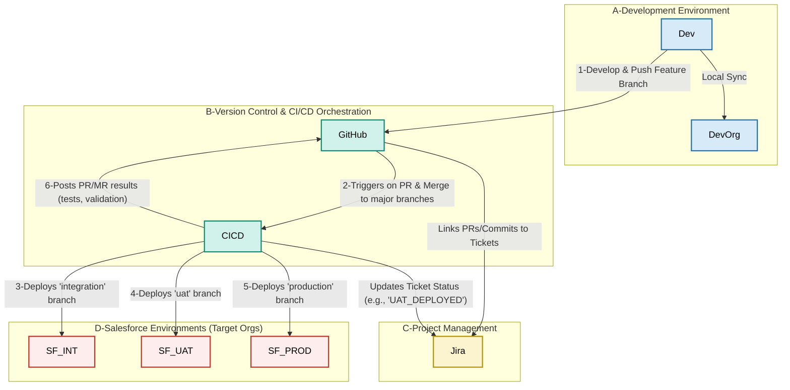
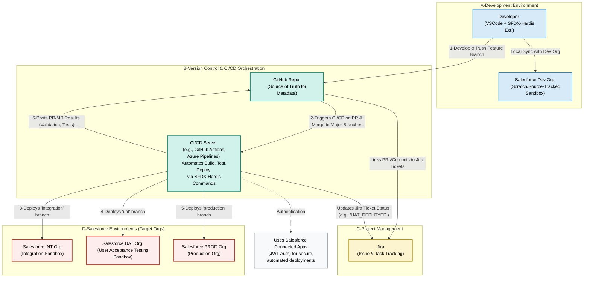

Essentially, that section of the diagram was meant to point to the detailed descriptions of:

*   **Developer (VSCode + SFDX-Hardis Ext.)**: How the developer uses VSCode and the SFDX-Hardis extension for local work.
*   **Salesforce Dev Org**: The role of scratch orgs or source-tracked sandboxes for isolated development.
*   **GitHub Repo**: Its function as the central version control system and source of truth.
*   **CI/CD Server**: The automation server (like GitHub Actions, Azure Pipelines) that executes SFDX-Hardis commands for builds, tests, and deployments.
*   **Jira**: The project management tool and how SFDX-Hardis links development work to tasks.
*   **Salesforce INT, UAT, PROD Orgs**: The purpose of each of these environments in the deployment pipeline.
*   **Connected App**: How the CI/CD server securely authenticates with the Salesforce orgs using JWT-based Connected Apps, a setup facilitated by SFDX-Hardis.

The diagram aimed to show the *actors* and *systems* involved, and the "Explanation" part was to remind us that the detailed interactions and roles were described in the text.


**Explanation of Diagram Components:**

* **A. Development Environment:**  
  * **Developer (VSCode \+ SFDX-Hardis Ext.)**: Represents the developer working locally using Visual Studio Code with the SFDX-Hardis extension. This is where tasks are initiated, code is written, and changes are committed.  
  * **Salesforce Dev Org (Scratch/Source-Tracked Sandbox)**: The isolated Salesforce environment (either a scratch org or a source-tracked sandbox) where the developer performs and tests their changes locally before pushing to the shared repository.  
* **B. Version Control & CI/CD Orchestration:**  
  * **GitHub Repo**: The central Git repository (e.g., on GitHub, GitLab, Azure Repos) that stores all project metadata in different branches (feature/\*, integration, uat, production). It serves as the source of truth.  
  * **CI/CD Server**: The automation server (e.g., GitHub Actions, Azure Pipelines, GitLab CI, Jenkins) that runs SFDX-Hardis commands to build, test, and deploy changes. It is triggered by events in the GitHub Repo.  
* **C. Project Management:**  
  * **Jira**: The issue tracking and project management tool where development tasks (user stories, bugs) are defined and tracked. SFDX-Hardis facilitates linking these tasks to code changes.  
* **D. Salesforce Environments (Target Orgs):**  
  * **Salesforce INT Org**: An integration sandbox where changes from different feature branches are merged and tested together. Deployed from the integration Git branch.  
  * **Salesforce UAT Org**: A User Acceptance Testing sandbox where business users validate features. Deployed from the uat Git branch.  
  * **Salesforce PROD Org**: The live production environment. Deployed from the production (or main) Git branch.  
  * **Connected App**: Each major Salesforce org (INT, UAT, PROD) has a Salesforce Connected App configured. The CI/CD server uses JWT-based authentication with these Connected Apps to securely perform automated deployments and other actions without needing to store Salesforce credentials directly in the CI/CD server. SFDX-Hardis helps automate the setup of these Connected Apps.  
* **E. Explanation of Participants & Interactions:** This section provides a textual description of each component's role and how they interact within the SFDX-Hardis powered demo workflow.

**Flow Highlights:**

1. Developers use VSCode with the SFDX-Hardis extension to work on tasks in their dedicated Dev Orgs and push feature branches to the GitHub Repo.  
2. Pushing to feature branches and creating Pull/Merge Requests (PRs/MRs) to major branches (like integration), or merging into major branches, triggers the CI/CD Server.  
3. The CI/CD Server, using SFDX-Hardis commands, deploys the integration branch to the INT Org.  
4. After successful integration and UAT PR/MR creation, the CI/CD Server deploys the uat branch to the UAT Org.  
5. After successful UAT and Production PR/MR creation, the CI/CD Server deploys the production branch to the PROD Org.  
6. Throughout the process, the CI/CD server posts feedback (like test results and validation status) back to the PRs/MRs in GitHub.  
7. Jira tickets are linked to commits and PRs/MRs in GitHub, and the CI/CD server can update Jira tickets with deployment statuses (e.g., "UAT\_DEPLOYED").

   For SFDX-Hardis with GitHub, the CI/CD server isn't a separate installation - it uses **GitHub Actions** as the CI/CD server, which is GitHub's built-in automation platform.

Here's how it works:

## GitHub Actions as CI/CD Server

When you initialize sfdx-hardis config, GitHub workflows are automatically copied to your repo. This means:

1. **No separate server needed** - GitHub Actions runs directly in GitHub's cloud infrastructure
2. **Automatic setup** - SFDX-Hardis provides pre-built workflow templates
3. **Built into GitHub** - Uses your existing GitHub repository

## Setup Process

Based on the search results, the typical setup involves:

1. **Initialize SFDX-Hardis** in your project:
   ```bash
   sf hardis:project:configure:auth
   ```

2. **Workflow files are created** - SFDX-Hardis automatically generates `.github/workflows/` files in your repository

3. **GitHub Actions triggers** - These workflows run automatically on:
   - Pull requests
   - Merges to main branches (integration, uat, production)
   - Scheduled backups

## Docker Images for CI/CD

SFDX-Hardis provides Docker images specifically for CI/CD environments, including `hardisgroupcom/sfdx-hardis:latest-sfdx-recommended`, which the GitHub Actions workflows use to execute commands.

## Key Benefits

- **No infrastructure management** - GitHub handles the compute resources
- **Pre-configured workflows** - Ready-to-use templates for Salesforce deployments
- **Integrated with GitHub** - Automatic status comments on pull requests from CI jobs

So essentially, GitHub Actions **is** your CI/CD server when using SFDX-Hardis with GitHub!

In your case, it's **GitHub repo + Docker**, but the Docker part is handled automatically by GitHub Actions - you don't need to manage it yourself.

Here's the breakdown:

## What You Manage
- **GitHub repository** - Your code, workflows, and configuration

## What GitHub Actions Manages Automatically
- **Docker containers** - GitHub Actions automatically pulls and runs the SFDX-Hardis Docker images (like `hardisgroupcom/sfdx-hardis:latest-sfdx-recommended`) when your workflows execute

## How It Works
1. You push code to your GitHub repo
2. GitHub Actions workflows trigger
3. GitHub Actions automatically spins up Docker containers using SFDX-Hardis images
4. The containers run your deployment commands
5. Containers are destroyed after the job completes

## From Your Perspective
You only interact with:
- Your GitHub repository
- The workflow YAML files (which SFDX-Hardis generates for you)
- Your Salesforce orgs

You **don't** need to:
- Install Docker locally (unless you want to)
- Manage Docker containers
- Set up a separate CI/CD server
- Handle infrastructure

So while Docker is technically involved "behind the scenes," GitHub Actions handles all the Docker complexity for you. You just work with your GitHub repo and let the automation do the rest!

It's essentially "GitHub repo + invisible Docker magic" from your day-to-day perspective.
