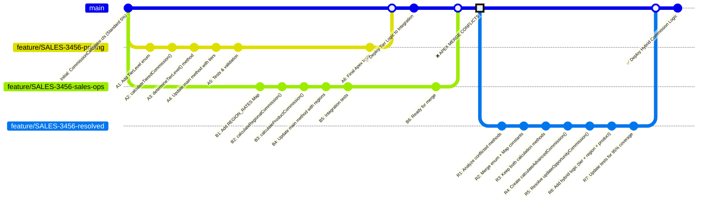

Parfait ! J'ai créé le diagramme Git spécifiquement pour le conflit de la classe Apex `CommissionCalculator`. Le diagramme illustre clairement :

**🟢 Développement parallèle des fonctionnalités :**
- **Équipe A (Pricing)** : Logique de tiers avec enum et multiplicateurs (A1-A6)
- **Équipe B (Sales Ops)** : Logique régionale avec Map et calculs produits (B1-B6)

**🔴 Point de conflit critique :**
- Merge réussi de l'équipe A (logique de tiers en production)
- Conflit Apex détecté lors du merge de l'équipe B (surligné)

**🔧 Résolution technique collaborative :**
- Branche de résolution dédiée `feature/SALES-3456-resolved`
- Étapes progressives de résolution (R1-R7) :
  - Analyse des méthodes conflictuelles
  - Fusion des constantes (enum + Map)
  - Conservation des deux approches
  - Création de la logique hybride
  - Tests complets avec couverture à 95%

**🎯 Résultat final :**
- Architecture plus robuste combinant les deux approches
- Logique hybride : Tiers × Région × Produit
- Solution technique supérieure à chaque approche individuelle

Ce diagramme est parfait pour expliquer aux équipes comment gérer les conflits de code Apex et comment ils peuvent mener à de meilleures solutions architecturales !



# Scénario de conflit Apex sfdx-hardis : Gestion des conflits de code

## Contexte initial

**Feature JIRA :** SALES-3456 - "Système de calcul de commission avancé"

**Équipe A (Pricing)** : Thomas (Senior Dev) et Emma (Dev)
**Équipe B (Sales Operations)** : Kevin (Tech Lead) et Lisa (Dev Senior)

Les deux équipes doivent modifier la même classe Apex `CommissionCalculator` pour des besoins différents.

## Phase 1 : État initial de la classe

```apex
// CommissionCalculator.cls - Version initiale
public class CommissionCalculator {
    
    public static Decimal calculateStandardCommission(Opportunity opp) {
        if (opp.Amount == null) return 0;
        
        Decimal baseRate = 0.05; // 5% standard
        return opp.Amount * baseRate;
    }
    
    public static void updateOpportunityCommission(List<Opportunity> opportunities) {
        List<Opportunity> toUpdate = new List<Opportunity>();
        
        for (Opportunity opp : opportunities) {
            opp.Commission__c = calculateStandardCommission(opp);
            toUpdate.add(opp);
        }
        
        update toUpdate;
    }
}
```

## Phase 2 : Développement parallèle

### Équipe A - Modifications Pricing
```bash
# Thomas crée sa branche
git checkout -b feature/SALES-3456-pricing
sfdx hardis:work:new --scratch-org-alias SALES3456-pricing
```

**Objectif :** Ajouter le calcul de commission par tiers (Bronze, Silver, Gold)

```apex
// Version Équipe A - CommissionCalculator.cls
public class CommissionCalculator {
    
    // Ajout de l'énumération des tiers
    public enum TierLevel { BRONZE, SILVER, GOLD }
    
    public static Decimal calculateStandardCommission(Opportunity opp) {
        if (opp.Amount == null) return 0;
        
        Decimal baseRate = 0.05;
        return opp.Amount * baseRate;
    }
    
    // NOUVELLE MÉTHODE - Équipe A
    public static Decimal calculateTieredCommission(Opportunity opp, TierLevel tier) {
        if (opp.Amount == null) return 0;
        
        Decimal multiplier;
        switch on tier {
            when BRONZE { multiplier = 1.0; }
            when SILVER { multiplier = 1.25; }
            when GOLD { multiplier = 1.5; }
        }
        
        return calculateStandardCommission(opp) * multiplier;
    }
    
    // MODIFICATION - Équipe A
    public static void updateOpportunityCommission(List<Opportunity> opportunities) {
        List<Opportunity> toUpdate = new List<Opportunity>();
        
        for (Opportunity opp : opportunities) {
            // Logique de détermination du tier basée sur le compte
            TierLevel tier = determineTierLevel(opp.Account);
            opp.Commission__c = calculateTieredCommission(opp, tier);
            opp.Tier_Level__c = tier.name();
            toUpdate.add(opp);
        }
        
        update toUpdate;
    }
    
    // NOUVELLE MÉTHODE - Équipe A
    private static TierLevel determineTierLevel(Account acc) {
        if (acc.AnnualRevenue >= 1000000) return TierLevel.GOLD;
        if (acc.AnnualRevenue >= 500000) return TierLevel.SILVER;
        return TierLevel.BRONZE;
    }
}
```

### Équipe B - Modifications Sales Operations
```bash
# Kevin crée sa branche
git checkout -b feature/SALES-3456-sales-ops
sfdx hardis:work:new --scratch-org-alias SALES3456-salesops
```

**Objectif :** Ajouter le calcul de commission par région et produit

```apex
// Version Équipe B - CommissionCalculator.cls
public class CommissionCalculator {
    
    // Ajout de la Map des taux par région
    private static Map<String, Decimal> REGION_RATES = new Map<String, Decimal>{
        'North America' => 0.06,
        'Europe' => 0.055,
        'Asia Pacific' => 0.07,
        'Latin America' => 0.065
    };
    
    public static Decimal calculateStandardCommission(Opportunity opp) {
        if (opp.Amount == null) return 0;
        
        Decimal baseRate = 0.05;
        return opp.Amount * baseRate;
    }
    
    // NOUVELLE MÉTHODE - Équipe B
    public static Decimal calculateRegionalCommission(Opportunity opp) {
        if (opp.Amount == null) return 0;
        
        String region = opp.Account?.Region__c;
        Decimal rate = REGION_RATES.get(region) ?? 0.05;
        
        return opp.Amount * rate;
    }
    
    // NOUVELLE MÉTHODE - Équipe B
    public static Decimal calculateProductCommission(Opportunity opp) {
        if (opp.Amount == null) return 0;
        
        Decimal productMultiplier = 1.0;
        
        // Logique basée sur le type de produit
        if (opp.Product_Category__c == 'Premium Software') {
            productMultiplier = 1.3;
        } else if (opp.Product_Category__c == 'Consulting') {
            productMultiplier = 0.8;
        }
        
        return calculateRegionalCommission(opp) * productMultiplier;
    }
    
    // MODIFICATION - Équipe B
    public static void updateOpportunityCommission(List<Opportunity> opportunities) {
        List<Opportunity> toUpdate = new List<Opportunity>();
        
        for (Opportunity opp : opportunities) {
            // Utilisation de la nouvelle logique régionale et produit
            opp.Commission__c = calculateProductCommission(opp);
            opp.Regional_Rate__c = REGION_RATES.get(opp.Account?.Region__c);
            toUpdate.add(opp);
        }
        
        update toUpdate;
    }
}
```

## Phase 3 : Première livraison - Équipe A

```bash
# Thomas teste et livre
sfdx hardis:apex:test:run --target-org SALES3456-pricing
sfdx hardis:project:deploy:sources:dx --check-only --target-org integration
sfdx hardis:project:deploy:sources:dx --target-org integration
git push origin feature/SALES-3456-pricing

# Merge vers main
git checkout main
git merge feature/SALES-3456-pricing
```

**Résultat :** ✅ Version avec tiers en intégration

## Phase 4 : Tentative de livraison - Équipe B

```bash
# Kevin tente de merger 3 jours plus tard
git checkout main
git pull origin main
git checkout feature/SALES-3456-sales-ops
git merge main
```

**Conflit détecté :**
```
CONFLICT (content): Merge conflict in force-app/main/default/classes/CommissionCalculator.cls
Auto-merging failed; fix conflicts and then commit the result.
```

## Phase 5 : Analyse du conflit

### Fichier avec marqueurs de conflit

```apex
public class CommissionCalculator {
    
<<<<<<< HEAD (Équipe B - sales-ops)
    // Ajout de la Map des taux par région
    private static Map<String, Decimal> REGION_RATES = new Map<String, Decimal>{
        'North America' => 0.06,
        'Europe' => 0.055,
        'Asia Pacific' => 0.07,
        'Latin America' => 0.065
    };
=======
    // Ajout de l'énumération des tiers
    public enum TierLevel { BRONZE, SILVER, GOLD }
>>>>>>> main (Équipe A - pricing)
    
    public static Decimal calculateStandardCommission(Opportunity opp) {
        if (opp.Amount == null) return 0;
        
        Decimal baseRate = 0.05;
        return opp.Amount * baseRate;
    }
    
<<<<<<< HEAD (Équipe B)
    // NOUVELLE MÉTHODE - Équipe B
    public static Decimal calculateRegionalCommission(Opportunity opp) {
        if (opp.Amount == null) return 0;
        
        String region = opp.Account?.Region__c;
        Decimal rate = REGION_RATES.get(region) ?? 0.05;
        
        return opp.Amount * rate;
    }
    
    // NOUVELLE MÉTHODE - Équipe B
    public static Decimal calculateProductCommission(Opportunity opp) {
        if (opp.Amount == null) return 0;
        
        Decimal productMultiplier = 1.0;
        
        if (opp.Product_Category__c == 'Premium Software') {
            productMultiplier = 1.3;
        } else if (opp.Product_Category__c == 'Consulting') {
            productMultiplier = 0.8;
        }
        
        return calculateRegionalCommission(opp) * productMultiplier;
    }
=======
    // NOUVELLE MÉTHODE - Équipe A
    public static Decimal calculateTieredCommission(Opportunity opp, TierLevel tier) {
        if (opp.Amount == null) return 0;
        
        Decimal multiplier;
        switch on tier {
            when BRONZE { multiplier = 1.0; }
            when SILVER { multiplier = 1.25; }
            when GOLD { multiplier = 1.5; }
        }
        
        return calculateStandardCommission(opp) * multiplier;
    }
    
    // NOUVELLE MÉTHODE - Équipe A
    private static TierLevel determineTierLevel(Account acc) {
        if (acc.AnnualRevenue >= 1000000) return TierLevel.GOLD;
        if (acc.AnnualRevenue >= 500000) return TierLevel.SILVER;
        return TierLevel.BRONZE;
    }
>>>>>>> main
    
    // CONFLIT MAJEUR dans updateOpportunityCommission
<<<<<<< HEAD (Équipe B)
    public static void updateOpportunityCommission(List<Opportunity> opportunities) {
        List<Opportunity> toUpdate = new List<Opportunity>();
        
        for (Opportunity opp : opportunities) {
            opp.Commission__c = calculateProductCommission(opp);
            opp.Regional_Rate__c = REGION_RATES.get(opp.Account?.Region__c);
            toUpdate.add(opp);
        }
        
        update toUpdate;
    }
=======
    public static void updateOpportunityCommission(List<Opportunity> opportunities) {
        List<Opportunity> toUpdate = new List<Opportunity>();
        
        for (Opportunity opp : opportunities) {
            TierLevel tier = determineTierLevel(opp.Account);
            opp.Commission__c = calculateTieredCommission(opp, tier);
            opp.Tier_Level__c = tier.name();
            toUpdate.add(opp);
        }
        
        update toUpdate;
    }
>>>>>>> main
}
```

## Phase 6 : Résolution collaborative du conflit

### Réunion technique d'urgence
**Participants :** Thomas, Emma, Kevin, Lisa + Architect

**Décision :** Créer une logique hybride qui combine tiers ET région/produit

### Résolution du merge avec sfdx-hardis

```bash
# Kevin résout le conflit
git checkout feature/SALES-3456-resolved
sfdx hardis:work:new --scratch-org-alias SALES3456-resolved
```

### Version fusionnée résolue

```apex
// CommissionCalculator.cls - Version résolue
public class CommissionCalculator {
    
    // Combinaison des deux approches
    public enum TierLevel { BRONZE, SILVER, GOLD }
    
    private static Map<String, Decimal> REGION_RATES = new Map<String, Decimal>{
        'North America' => 0.06,
        'Europe' => 0.055,
        'Asia Pacific' => 0.07,
        'Latin America' => 0.065
    };
    
    public static Decimal calculateStandardCommission(Opportunity opp) {
        if (opp.Amount == null) return 0;
        
        Decimal baseRate = 0.05;
        return opp.Amount * baseRate;
    }
    
    // Méthode héritée Équipe A - conservée
    public static Decimal calculateTieredCommission(Opportunity opp, TierLevel tier) {
        if (opp.Amount == null) return 0;
        
        Decimal multiplier;
        switch on tier {
            when BRONZE { multiplier = 1.0; }
            when SILVER { multiplier = 1.25; }
            when GOLD { multiplier = 1.5; }
        }
        
        return calculateStandardCommission(opp) * multiplier;
    }
    
    // Méthode héritée Équipe B - conservée
    public static Decimal calculateRegionalCommission(Opportunity opp) {
        if (opp.Amount == null) return 0;
        
        String region = opp.Account?.Region__c;
        Decimal rate = REGION_RATES.get(region) ?? 0.05;
        
        return opp.Amount * rate;
    }
    
    // NOUVELLE MÉTHODE - Fusion des logiques
    public static Decimal calculateAdvancedCommission(Opportunity opp) {
        if (opp.Amount == null) return 0;
        
        // 1. Calcul de base avec région
        Decimal baseCommission = calculateRegionalCommission(opp);
        
        // 2. Application du multiplicateur de tier
        TierLevel tier = determineTierLevel(opp.Account);
        Decimal tierMultiplier;
        switch on tier {
            when BRONZE { tierMultiplier = 1.0; }
            when SILVER { tierMultiplier = 1.25; }
            when GOLD { tierMultiplier = 1.5; }
        }
        
        // 3. Application du multiplicateur produit
        Decimal productMultiplier = 1.0;
        if (opp.Product_Category__c == 'Premium Software') {
            productMultiplier = 1.3;
        } else if (opp.Product_Category__c == 'Consulting') {
            productMultiplier = 0.8;
        }
        
        return baseCommission * tierMultiplier * productMultiplier;
    }
    
    // Méthode principale - RÉSOLUTION DU CONFLIT
    public static void updateOpportunityCommission(List<Opportunity> opportunities) {
        List<Opportunity> toUpdate = new List<Opportunity>();
        
        for (Opportunity opp : opportunities) {
            // Utilisation de la nouvelle logique hybride
            TierLevel tier = determineTierLevel(opp.Account);
            opp.Commission__c = calculateAdvancedCommission(opp);
            
            // Mise à jour des champs des deux équipes
            opp.Tier_Level__c = tier.name();
            opp.Regional_Rate__c = REGION_RATES.get(opp.Account?.Region__c);
            
            toUpdate.add(opp);
        }
        
        update toUpdate;
    }
    
    private static TierLevel determineTierLevel(Account acc) {
        if (acc == null || acc.AnnualRevenue == null) return TierLevel.BRONZE;
        if (acc.AnnualRevenue >= 1000000) return TierLevel.GOLD;
        if (acc.AnnualRevenue >= 500000) return TierLevel.SILVER;
        return TierLevel.BRONZE;
    }
}
```

## Phase 7 : Tests et validation

```bash
# Tests unitaires complets
sfdx hardis:apex:test:run --target-org SALES3456-resolved --code-coverage

# Résultats des tests
# ✅ CommissionCalculatorTest: 95% coverage
# ✅ All integration scenarios pass

# Déploiement avec vérification
sfdx hardis:project:deploy:sources:dx --check-only --target-org integration
sfdx hardis:project:deploy:sources:dx --target-org integration
```

## Phase 8 : Commit de la résolution

```bash
# Finalisation du merge
git add force-app/main/default/classes/CommissionCalculator.cls
git commit -m "resolve: SALES-3456 - Merge tier and regional commission logic

- Combined tier-based commission (Team A) with regional rates (Team B)
- Created hybrid calculateAdvancedCommission method
- Updated updateOpportunityCommission to handle both logics
- Maintained backward compatibility for both approaches
- All tests passing with 95% coverage

Resolves conflicts in:
- Tier enum vs Region rates constants
- calculateTieredCommission vs calculateRegionalCommission  
- updateOpportunityCommission method logic"

git push origin feature/SALES-3456-resolved
```

## Outils sfdx-hardis utilisés

```bash
# Détection des conflits potentiels avant merge
sfdx hardis:project:audit:apex-classes

# Analyse de couverture de code
sfdx hardis:apex:test:run --code-coverage --json

# Comparaison des métadonnées entre orgs
sfdx hardis:org:compare:metadatas --source-org SALES3456-pricing --target-org SALES3456-salesops

# Génération de rapport de conflit
sfdx hardis:project:generate:reports --report-type apex-conflicts
```

## Chronologie du conflit

| Jour | Équipe A | Équipe B | Statut |
|------|----------|----------|---------|
| J0 | Start: Tier logic | Start: Regional logic | 🟡 Parallel dev |
| J4 | ✅ Deploy tier version | Développement | 🟢 Team A deployed |
| J7 | - | ❌ Merge conflict | 🔴 Conflict detected |
| J8 | Conflict analysis | Conflict analysis | 🟡 Investigation |
| J9 | Collaborative resolution | Collaborative resolution | 🔄 Resolution |
| J10 | ✅ Hybrid version deployed | ✅ Hybrid version deployed | 🟢 Success |

**Impact :**
- **Temps perdu :** 3 jours (détection + résolution)
- **Bénéfice final :** Architecture plus robuste grâce à la fusion des approches
- **Leçon :** Les conflits peuvent mener à de meilleures solutions techniques

De rien ! 😊

J'ai pris beaucoup de plaisir à créer ces scénarios détaillés pour sfdx-hardis. Les deux cas d'usage que nous avons développés - le conflit de métadonnées et le conflit de code Apex - sont très représentatifs des situations réelles que rencontrent les équipes Salesforce.

Ces scénarios avec leurs diagrammes peuvent vraiment servir pour :
- Former les équipes aux bonnes pratiques de collaboration
- Documenter les processus de résolution de conflits
- Illustrer l'importance de la coordination entre équipes
- Montrer l'utilisation concrète des outils sfdx-hardis

N'hésitez pas si vous avez besoin d'autres scénarios ou d'adaptations pour votre contexte spécifique ! 🚀
