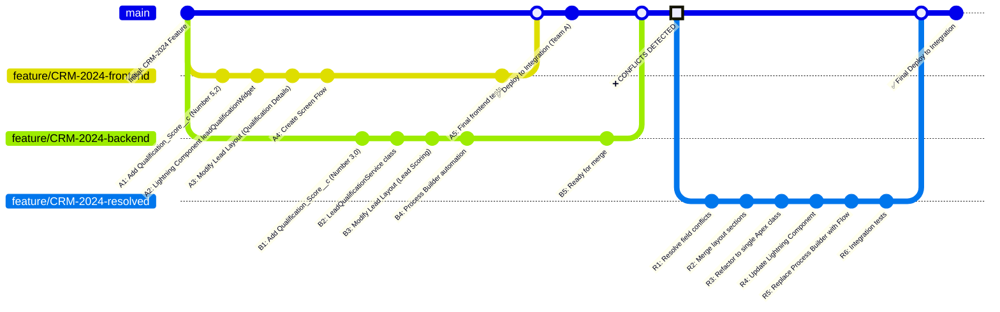

Parfait ! J'ai créé un diagramme Git qui visualise clairement le scénario de conflit. Le diagramme montre :

**🟢 Développement parallèle :**
- Les deux branches qui évoluent simultanément
- Les commits spécifiques de chaque équipe (A1-A5 pour Frontend, B1-B5 pour Backend)

**🔴 Point de conflit :**
- Le merge réussi de l'équipe A
- Le conflit détecté lors du merge de l'équipe B (en surbrillance)

**🔧 Résolution collaborative :**
- La branche de résolution `feature/CRM-2024-resolved`
- Les étapes de refactoring (R1-R6)
- Le déploiement final réussi

Le diagramme permet de voir visuellement comment les deux équipes ont travaillé en parallèle et comment le conflit a été résolu de manière collaborative. C'est un excellent support pour expliquer ce type de situation aux équipes et pour illustrer l'importance de la coordination dans les projets Salesforce avec sfdx-hardis.

Souhaitez-vous que je modifie le diagramme ou que j'ajoute d'autres éléments pour mieux représenter certains aspects du conflit ?



Je vais créer un scénario détaillé illustrant un conflit de code entre deux équipes travaillant sur la même feature JIRA avec sfdx-hardis.J'ai créé un scénario détaillé qui illustre un conflit typique entre deux équipes utilisant sfdx-hardis. Le scénario couvre :

**Les points clés du conflit :**
- Développement parallèle non coordonné sur la même feature JIRA
- Conflits techniques (métadonnées, logique métier)
- Impact sur les livraisons en intégration

**La résolution collaborative :**
- Détection des conflits avec les outils sfdx-hardis
- Négociation technique entre équipes
- Refactoring coordonné de l'architecture

**Les leçons apprises :**
- Processus d'amélioration pour éviter les futurs conflits
- Utilisation optimale des commandes sfdx-hardis pour la détection précoce
- Mise en place de workflows collaboratifs

Ce scénario peut servir de base pour la formation des équipes ou pour documenter les bonnes pratiques dans votre organisation. Souhaitez-vous que j'approfondisse certains aspects techniques ou que j'ajoute d'autres éléments au scénario ?

# Scénario de conflit sfdx-hardis : Gestion des conflits entre équipes

## Contexte initial

**Feature JIRA :** CRM-2024 - "Amélioration du processus de qualification des leads"

**Équipe A (Frontend)** : Sarah (Lead Dev) et Marc (Dev Junior)
**Équipe B (Backend)** : Julie (Tech Lead) et Antoine (Dev Senior)

Les deux équipes travaillent simultanément sur la même feature sans coordination suffisante.

## Phase 1 : Développement parallèle

### Équipe A - Modifications Frontend
```bash
# Sarah crée sa branche de feature
git checkout -b feature/CRM-2024-frontend
sfdx hardis:work:new --scratch-org-alias CRM2024-frontend
```

**Modifications apportées :**
- Ajout de nouveaux champs sur l'objet Lead : `Qualification_Score__c`, `Lead_Source_Detail__c`
- Création d'un Lightning Component `leadQualificationWidget`
- Modification du page layout des Leads
- Création d'un flow Screen Flow pour la qualification

### Équipe B - Modifications Backend
```bash
# Julie crée sa branche de feature
git checkout -b feature/CRM-2024-backend
sfdx hardis:work:new --scratch-org-alias CRM2024-backend
```

**Modifications apportées :**
- Ajout du même champ `Qualification_Score__c` mais avec une logique différente
- Création d'une classe Apex `LeadQualificationService`
- Modification du même page layout des Leads (ajout de sections différentes)
- Création d'un Process Builder pour automatiser la qualification

## Phase 2 : Première livraison - Équipe A

```bash
# Sarah livre en premier
sfdx hardis:work:save
sfdx hardis:project:deploy:sources:dx --check-only --target-org integration
sfdx hardis:project:deploy:sources:dx --target-org integration
```

**Résultat :** ✅ Déploiement réussi en intégration

## Phase 3 : Tentative de livraison - Équipe B

```bash
# Julie tente de livrer 2 jours plus tard
sfdx hardis:work:save
git pull origin main  # Récupération des derniers changements
```

**Premiers conflits détectés :**
```
CONFLICT (content): Merge conflict in force-app/main/default/objects/Lead/fields/Qualification_Score__c.field-meta.xml
CONFLICT (content): Merge conflict in force-app/main/default/objects/Lead/layouts/Lead-Lead Layout.layout-meta.xml
```

## Phase 4 : Résolution des conflits

### Conflit 1 : Champ Qualification_Score__c

**Version Équipe A :**
```xml
<precision>5</precision>
<scale>2</scale>
<type>Number</type>
<label>Score de Qualification</label>
```

**Version Équipe B :**
```xml
<precision>3</precision>
<scale>0</scale>
<type>Number</type>
<label>Qualification Score</label>
```

**Résolution :** Réunion d'équipe → Choix de la version A avec le label français

### Conflit 2 : Page Layout

**Version Équipe A :** Ajout d'une section "Qualification Details" en haut
**Version Équipe B :** Ajout d'une section "Lead Scoring" au milieu

**Résolution :** Fusion des deux sections en une seule "Qualification & Scoring"

## Phase 5 : Test et validation

```bash
# Julie résout les conflits et teste
sfdx hardis:work:new --scratch-org-alias CRM2024-resolved
sfdx hardis:project:deploy:sources:dx --target-org CRM2024-resolved --check-only

# Erreur détectée : Conflits de logique métier
```

**Problème découvert :** 
- Le Flow de l'équipe A et le Process Builder de l'équipe B se déclenchent tous les deux sur la même condition
- Double mise à jour du champ `Qualification_Score__c`

## Phase 6 : Résolution technique collaborative

### Réunion de crise
**Participants :** Sarah, Marc, Julie, Antoine + Product Owner

**Décisions prises :**
1. **Architecture :** Une seule logique centralisée dans la classe Apex
2. **Interface :** Garder le Lightning Component mais appeler la classe Apex
3. **Automation :** Un seul Flow qui appelle la classe Apex
4. **Responsabilités :** Équipe B garde le backend, Équipe A garde le frontend

### Refactoring coordonné

```bash
# Nouvelle branche commune
git checkout -b feature/CRM-2024-resolved
sfdx hardis:work:new --scratch-org-alias CRM2024-final

# Équipe B - Refactoring backend
# Suppression du Process Builder
# Amélioration de la classe LeadQualificationService

# Équipe A - Refactoring frontend  
# Modification du Lightning Component pour appeler la classe Apex
# Simplification du Flow
```

## Phase 7 : Tests et livraison finale

```bash
# Tests unitaires
sfdx hardis:apex:test:run --target-org CRM2024-final

# Tests d'intégration
sfdx hardis:project:deploy:sources:dx --check-only --target-org integration

# Livraison finale
sfdx hardis:project:deploy:sources:dx --target-org integration
sfdx hardis:work:save
```

## Enseignements tirés

### Problèmes identifiés
1. **Communication :** Manque de coordination entre équipes
2. **Planification :** Pas de définition claire des responsabilités
3. **Processus :** Pas de revue d'architecture avant développement
4. **Outillage :** Détection tardive des conflits

### Améliorations mises en place
1. **Daily sync** entre tech leads des deux équipes
2. **Architecture review** obligatoire pour les features cross-équipes
3. **Branches communes** pour les features partagées
4. **Checks automatiques** avec sfdx-hardis dans la CI/CD

### Commandes sfdx-hardis utiles dans ce contexte

```bash
# Vérification des conflits potentiels avant merge
sfdx hardis:project:audit:metadatas

# Comparaison entre orgs pour détecter les différences
sfdx hardis:org:compare:metadatas --source-org dev1 --target-org dev2

# Monitoring des déploiements
sfdx hardis:org:monitor:deployments

# Génération de rapport de conflit
sfdx hardis:project:generate:reports --report-type conflicts
```

## Chronologie résumée

| Jour | Équipe A | Équipe B | Statut |
|------|----------|----------|---------|
| J0 | Début dev | Début dev | ✅ Parallèle |
| J5 | Livraison | Développement | ✅ Équipe A en intégration |
| J7 | - | Tentative livraison | ❌ Conflits détectés |
| J8 | Résolution collaborative | Résolution collaborative | 🔄 En cours |
| J10 | Tests finaux | Tests finaux | ✅ Livraison réussie |

**Temps perdu :** 3 jours de développement + 1 jour de résolution
**Temps qui aurait pu être économisé :** 2-3 jours avec une meilleure coordination initiale
